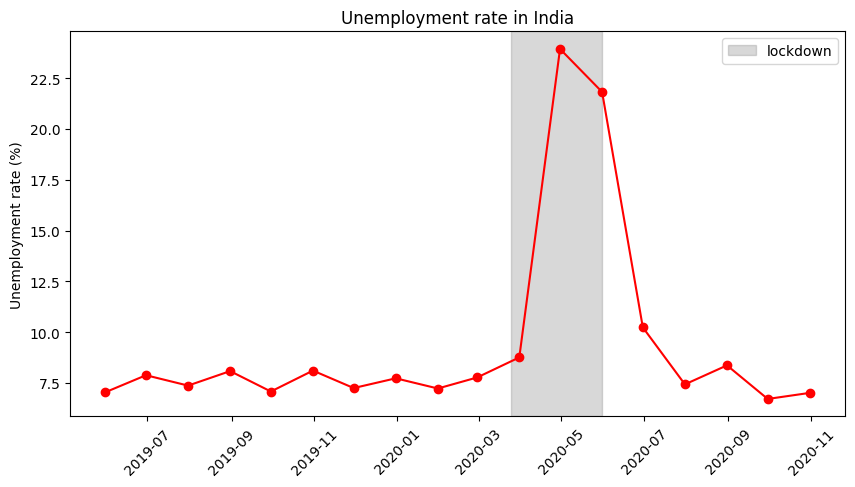
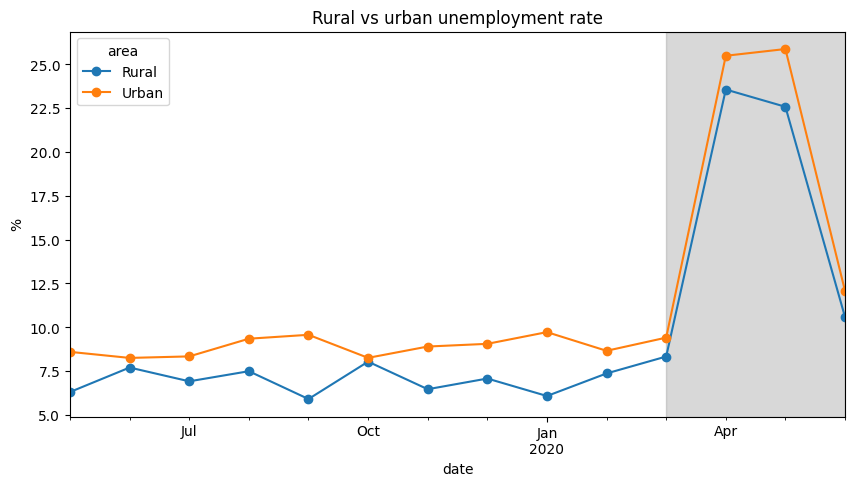

# Unemployment Analysis in India

A Python analysis of monthly unemployment data for Indian states (May 2019 to Oct 2020), with a focus on what happened during the Covid-19 lockdown.



## What the notebook does

- Cleans the two CSV files (empty rows, extra spaces in column names, date formats, swapped latitude/longitude headers)
- Explores the data with summary statistics
- Calculates the national unemployment rate, weighted by labour force
- Compares unemployment before, during and after the lockdown
- Compares rural and urban areas
- Looks at the most affected states and zones
- Checks for seasonal patterns before Covid

## Main findings

- The unemployment rate was around 7 to 8% before the lockdown, jumped to about 24% in April 2020, and went back to around 7% by October.
- About 128 million fewer people were employed in April than in February, and the labour participation rate dropped from 44.4% to 37.5%.
- Urban areas were hit slightly harder than rural areas.
- The East and South zones had the highest rates in April. Puducherry, Jharkhand, Tamil Nadu and Bihar had the biggest increases.
- With only about 18 months of data, seasonality can't be checked properly.



## Project structure

```
CodeAlpha_UnemploymentAnalysis/
├── Unemployment_Analysis.ipynb
├── data/
│   ├── Unemployment_in_India.csv
│   └── Unemployment_Rate_upto_11_2020.csv
├── images/
├── requirements.txt
└── README.md
```

## How to run

```
pip install -r requirements.txt
jupyter notebook
```

Then open `Unemployment_Analysis.ipynb` and run all cells.

## Tools

Python, pandas, matplotlib, Jupyter Notebook
